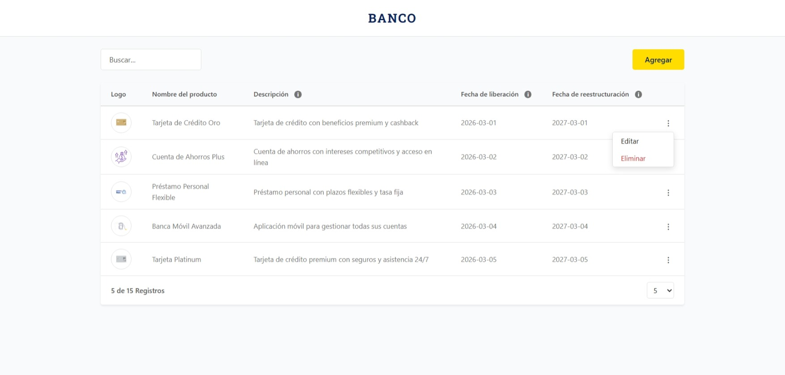
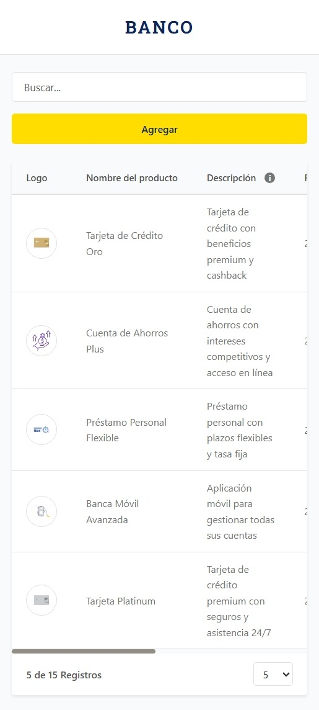
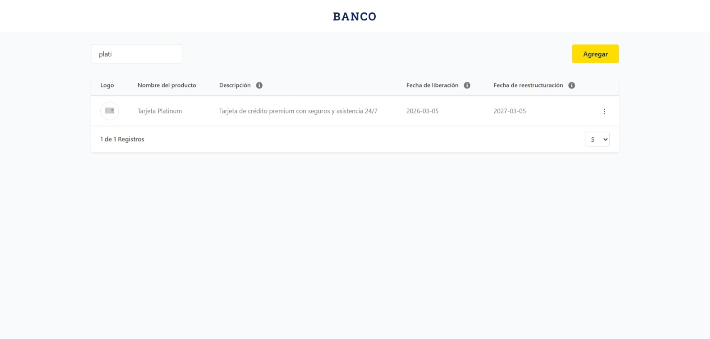
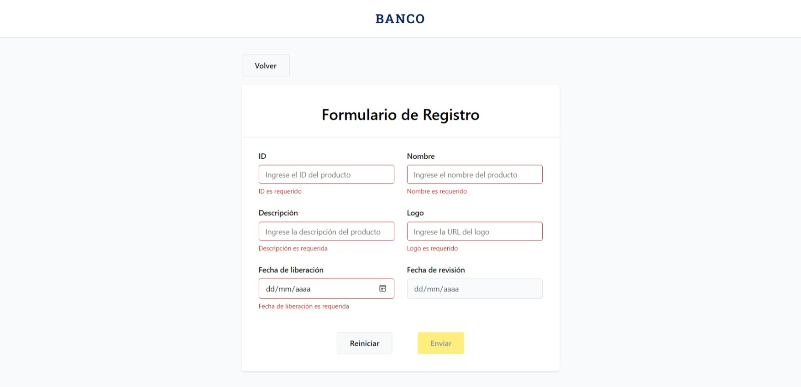
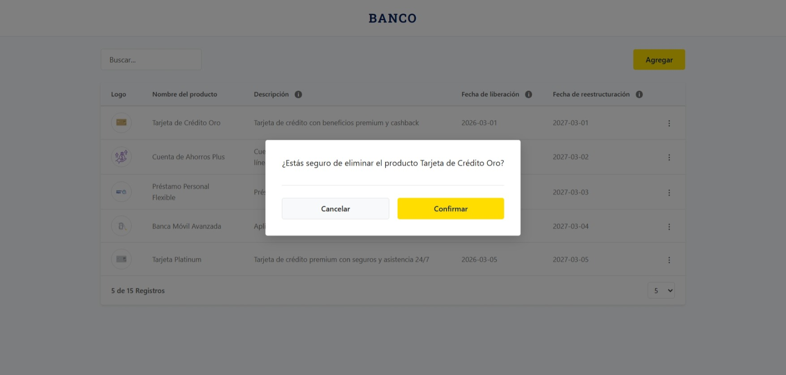
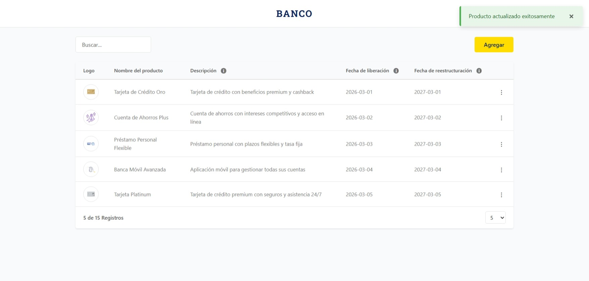

# 🏦 Productos Financieros

Aplicación web para la gestión de productos financieros (CRUD) con **Angular 19**, **Signals**, **formularios reactivos** y **Jest**.  
Implementa 100% de las funcionalidades requeridas con buenas prácticas, SOLID y cobertura de 100% en statements, lines y functions.

---

## ⚡ Quick Start

### Requisitos previos

- **Node.js** >= 20.11.1
- **npm** >= 10
- **Backend** corriendo en `http://localhost:3002` (ver [Configuración del Backend](#️-configuración-del-backend))

### Instalación y ejecución

```bash
# Clonar y entrar al proyecto
git clone https://github.com/Joguisa/bp-financial-products
cd bp-financial-products

# Instalar dependencias
npm install

# Levantar aplicación (se abre automáticamente en http://localhost:4200)
ng s -o
```

---

## ✨ Funcionalidades Implementadas

| Funcionalidad | Estado | Descripción |
|---|---|---|
| **F1** - Listado de productos | Completado | Visualización de todos los productos desde la API |
| **F2** - Búsqueda de productos | Completado | Filtro en tiempo real con debounce 300ms |
| **F3** - Paginación | Completado | Selector de registros por página (5, 10, 20) |
| **F4** - Crear producto | Completado | Formulario reactivo con validaciones completas |
| **F5** - Editar producto | Completado | Menú contextual dropdown con edición |
| **F6** - Eliminar producto | Completado | Modal de confirmación antes de eliminar |

---

## 📋 Cumplimiento de Requisitos de la Prueba

### Requisitos Técnicos
- **Angular** >= 14 (v19.2 LTS)  
- **TypeScript** >= 4.8 (v5.7)  
- **Jest** para pruebas unitarias (v29)  
- **UI Development** sin frameworks CSS (SCSS puro)  
- **Manejo de excepciones** con mensajes visuales de error  
- **156 tests** con cobertura **100% statements/lines/functions**  

### Buenas Prácticas
- **SOLID Principles** - Single Responsibility, Dependency Injection, Interface Segregation  
- **Clean Code** - Nombres claros, funciones pequenas, DRY  
- **Store Pattern** - Separación entre API y estado  
- **OnPush Change Detection** - Optimización de rendimiento  
- **Responsive Design** - Adaptado a todos los tamaños  
- **Custom SCSS** - Sin componentes prefabricados  

---

## 🧪 Testing y Cobertura

```bash
# Ejecutar tests
npm test

# Watch mode (desarrollo)
npm run test:watch

# Reporte de cobertura
npm run test:coverage
```

### Resultado de Cobertura

| Métrica | Resultado |
|---|---|
| **Statements** | 100% |
| **Lines** | 100% |
| **Functions** | 100% |
| **Branches** | 94.91% |

**156 tests** distribuidos en **16 suites**:
- 5 servicios (API + Store)  
- 8 componentes (form, table, search, tabla, etc.)  
- Validadores (sync y async)  
- Interceptor HTTP  
- Edge cases (errores, timeout, producto no existe)  

---

## 🛠️ Stack Tecnológico

| Tecnología | Versión | Justificación |
|---|---|---|
| Angular | 19.2 LTS | Signals estables, `@if`/`@for` nativos, soporte hasta mayo 2026 |
| Node.js | 20 LTS | Compatible, soporte hasta abril 2026 |
| TypeScript | 5.7 | Rango soportado por Angular 19 |
| Jest | 29 | Test runner integrado con Angular DevKit |
| SCSS | — | Sin frameworks CSS (requisito) |
| RxJS | 7.8 | Manejo de flujos async |


---
## 🖼️ Capturas de Pantalla

### 📋 Listado de Productos (F1, F2, F3)

#### Vista Desktop – Acciones por producto


- Tabla responsiva con paginación
- Menú contextual por producto (Editar / Eliminar)
- Integración con navegación y modal de confirmación

#### Vista Responsive


- Diseño adaptable a dispositivos móviles
- Tabla optimizada para pantallas pequeñas
- Mantiene búsqueda y paginación funcional

#### Búsqueda y Filtrado


- Campo de búsqueda con debounce
- Filtrado reactivo sin recargar la página
- Actualización automática del contador de resultados

---

### 📝 Formulario de Creación / Edición (F4, F5)



- Validaciones en tiempo real por campo
- Mensajes de error descriptivos al perder el foco
- ID deshabilitado en modo edición
- Botones dinámicos (Agregar / Actualizar)
- Reinicio de formulario

---

### ⚠️ Modal de Confirmación (F6)



- Confirmación obligatoria antes de eliminar
- Flujo controlado mediante Signals
- Cierre automático tras confirmación o cancelación

### 🔔 Notificaciones (Toast)



- Notificaciones gestionadas con Signals
- Auto-dismiss configurable
- Diferenciación visual por tipo (success, error, warning, info)
---

## ⚙️ Configuración del Backend

La aplicación consume APIs locales. Para levantar el backend:

```bash
# 1. Descomprimir repo-interview-main.zip

# 2. Entrar a la carpeta
cd repo-interview-main

# 3. Instalar dependencias
npm install

# 4. Ejecutar en modo desarrollo
npm run start:dev

# Backend disponible en: http://localhost:3002
```

### Endpoints consumidos

| Método | Endpoint | Descripción |
|---|---|---|
| GET | `/bp/products` | Obtener todos los productos |
| POST | `/bp/products` | Crear producto |
| PUT | `/bp/products/:id` | Actualizar producto |
| DELETE | `/bp/products/:id` | Eliminar producto |
| GET | `/bp/products/verification/:id` | Verificar si ID existe |

**Nota:** El proxy en `proxy.conf.json` redirige `/bp/*` → `localhost:3002` automáticamente.

---

## 📦 Estructura del Proyecto

```
src/
├── app/
│   ├── app.component.html
│   ├── app.component.scss
│   ├── app.component.spec.ts
│   ├── app.component.ts
│   ├── app.config.ts
│   ├── app.routes.ts
│   ├── core/                                         # Infraestructura transversal
│   │   ├── constants/
│   │   │   ├── http-error-messages.constants.ts      # Mensajes de error HTTP
│   │   │   ├── http-status.constants.ts              # Códigos HTTP
│   │   │   └── notification-duration.constants.ts    # Duraciones de toast
│   │   ├── interceptors/
│   │   │   ├── http-error.interceptor.ts             # Manejo global de errores
│   │   │   └── http-error.interceptor.spec.ts
│   │   ├── models/
│   │   │   └── notification.model.ts                 # Modelo de notificación
│   │   ├── services/
│   │   │   ├── notification.service.ts               # Toast signal-based
│   │   │   └── notification.service.spec.ts
│   │   └── utils/
│   │       └── resolve-http-error-message.ts         # Resolución de mensajes
│   │
│   ├── shared/                                       # Componentes y utilidades reutilizables
│   │   ├── components/
│   │   │   ├── modal/
│   │   │   │   ├── modal.component.html
│   │   │   │   ├── modal.component.scss
│   │   │   │   ├── modal.component.ts
│   │   │   │   └── modal.component.spec.ts
│   │   │   ├── search-bar/
│   │   │   │   ├── search-bar.component.html
│   │   │   │   ├── search-bar.component.scss
│   │   │   │   ├── search-bar.component.ts
│   │   │   │   └── search-bar.component.spec.ts
│   │   │   ├── skeleton-table/
│   │   │   │   ├── skeleton-table.component.html
│   │   │   │   ├── skeleton-table.component.scss
│   │   │   │   ├── skeleton-table.component.ts
│   │   │   │   └── skeleton-table.component.spec.ts
│   │   │   └── toast/
│   │   │       ├── toast.component.html
│   │   │       ├── toast.component.scss
│   │   │       ├── toast.component.ts
│   │   │       └── toast.component.spec.ts
│   │   ├── utils/
│   │   │   ├── date.utils.ts
│   │   │   └── date.utils.spec.ts
│   │   └── validators/
│   │       ├── custom-validators.ts
│   │       └── custom-validators.spec.ts
│   │
│   ├── features/                                     # Feature CRUD de Productos
│   │   └── products/
│   │       ├── components/
│   │       │   ├── pagination/
│   │       │   │   ├── pagination.component.html
│   │       │   │   ├── pagination.component.scss
│   │       │   │   ├── pagination.component.ts
│   │       │   │   └── pagination.component.spec.ts
│   │       │   ├── product-form-fields/
│   │       │   │   ├── product-form-fields.component.html
│   │       │   │   ├── product-form-fields.component.scss
│   │       │   │   ├── product-form-fields.component.ts
│   │       │   │   └── product-form-fields.component.spec.ts
│   │       │   └── product-table/
│   │       │       ├── product-table.component.html
│   │       │       ├── product-table.component.scss
│   │       │       ├── product-table.component.ts
│   │       │       └── product-table.component.spec.ts
│   │       ├── models/
│   │       │   └── product.model.ts                  # FinancialProduct + LoadingState
│   │       ├── pages/
│   │       │   ├── product-form/
│   │       │   │   ├── product-form.component.html
│   │       │   │   ├── product-form.component.scss
│   │       │   │   ├── product-form.component.ts
│   │       │   │   └── product-form.component.spec.ts
│   │       │   └── product-list/
│   │       │       ├── product-list.component.html
│   │       │       ├── product-list.component.scss
│   │       │       ├── product-list.component.ts
│   │       │       └── product-list.component.spec.ts
│   │       ├── services/
│   │       │   ├── products-api.service.ts
│   │       │   ├── products-api.service.spec.ts
│   │       │   ├── products-store.service.ts
│   │       │   └── products-store.service.spec.ts
│   │       └── products.routes.ts                    # Lazy loading
│   │
│   └── app.component.ts                              # Header + outlet + toast
│
├── assets/
│   └── styles/
│       ├── _base.scss
│       ├── _components.scss
│       ├── _forms.scss
│       ├── _responsive.scss
│       └── _variables.scss
│
└── environments/
    └── environment.ts
```

---

## 🏗️ Arquitectura y Decisiones Técnicas

### Store Pattern con Separación de Responsabilidades

```typescript
┌─────────────────────────────────────┐
│   ProductsApiService (HTTP)         │
│   - Llamadas GET/POST/PUT/DELETE    │
│   - Retorna Observables             │
│   - Sin estado                      │
└────────────┬────────────────────────┘
             │
             ├─────────────────┐
             │                 │
┌─────────────────────┐  ProductsStoreService
│   Componentes       │   - Signals: products, loading
│   - Lee signáls     │   - Computed: filteredProducts
│   - No necesita     │   - Métodos: create, edit, delete
│     suscripciones   │   - Orquestación de flujos
└─────────────────────┘   - Manejo de errores
```

**Ventajas:**
- Single Responsibility: cada servicio tiene una razón para cambiar  
- Testeable: puedes mockear `ProductsApiService` fácilmente  
- Rendimiento: OnPush + Signals = cambios detectados automáticamente  
- Menos boilerplate que NgRx/Akita  

### Signals para Estado Reactivo

```typescript
// Actual (Signals)
private readonly _products = signal<FinancialProduct[]>([]);
readonly filteredProducts = computed(() => {
    const query = this._search().toLowerCase().trim();
    const all = this._products();
    ...
    return filtered.slice(0, this._pageSize());
  });

// Evitado (RxJS en exceso)
const products$ = new BehaviorSubject([]);
const filtered$ = products$.pipe(
  combineLatestWith(search$),
  map(([products, term]) => { ... }),
  shareReplay(1)
);
```

- Los componentes leen sin suscribirse: `products()`, `loading()`  
- Cambios detectados automáticamente con OnPush  
- TypeScript puro, sin Observables  

### RxJS Solo para Flujos Temporales

```typescript
// SearchBar: debounce + distinctUntilChanged
this.searchSubject.pipe(
  debounceTime(300),
  distinctUntilChanged()
).subscribe(value => this.search.emit(value));

// HttpClient: Observables son idiomáticos
return this.http.get<Product[]>('/bp/products');
```

### OnPush en Todos los Componentes

```typescript
@Component({
  selector: 'bp-product-table',
  changeDetection: ChangeDetectionStrategy.OnPush
})
```

- Reducidas ciclos de change detection innecesarios  
- Combinado con Signals: actualizaciones quirúrgicas  
- Mejora rendimiento en listas grandes  

### Signal-based Inputs/Outputs (API Moderna)

```typescript
// Actual (Angular 19)
products = input<FinancialProduct[]>([]);
edit = output<FinancialProduct>();
delete = output<FinancialProduct>();

// Evitado (decoradores antiguos)
@Input() products: Product[];
@Output() edited = new EventEmitter<FinancialProduct>();
@Output() deleted = new EventEmitter<FinancialProduct>();
```

- Type-safe automáticamente  
- Compatible con `effect()` para reacciones  
- Basado en el modelo de Signals  
- `input()` y `output()` importados desde `@angular/core`  

### Typed Reactive Forms

```typescript
const productForm = fb.nonNullable.group({
  this.fb.nonNullable.group({
      id: this.fb.nonNullable.control('', { validators: [...], asyncValidators: [...] }),
      name: this.fb.nonNullable.control('', [...]),
      // ...
});

// TypeScript sabe que form.value.id es string, nunca null
```

Beneficios:
- `reset()` retorna `''` en lugar de `null`  
- Autocompletado en `form.controls.id`  
- Sin necesidad de tipo genérico `<T>`  

### Validador Async Desacoplado

```typescript
// Inyectable: se prueba sin el servicio
export function uniqueId(verifyFn: (id: string) => Observable<boolean>): AsyncValidatorFn {
    return (control: AbstractControl): Observable<ValidationErrors | null> => {
        if (!control.value || control.value.trim().length < 3) {
            return of(null);
        }
        return of(control.value).pipe(
            debounceTime(300),
            switchMap(id => verifyFn(id)),
            map(exists => (exists ? { idExists: true } : null)),
            catchError(() => of(null)),
            first()
        );
    };
}

// En el formulario
asyncValidators: [uniqueId(id => this.api.verifyId(id))]
```

- Testeable sin dependencias externas  
- Reutilizable en otros contextos  
- Inversión de control clara  

### Timezone Seguro

```typescript
// Bug: new Date('2026-02-24') en Ecuador es 23-02
// Interpreta como UTC, pierde 5 horas

// Parsing manual con timezone local
const [year, month, day] = control.value.split('-').map(Number);
const inputDate = new Date(year, month - 1, day);
```

Aplica a:
- Validación de `date_release >= today`  
- Validación de `date_revision === date_release + 1 año`  

### Proxy CORS

```json
{
    "/bp": {
        "target": "http://localhost:3002",
        "secure": false,
        "changeOrigin": true,
        "logLevel": "debug"
    }
}
```

- Evita CORS sin modificar el backend  
- Funciona en desarrollo  
- Production: backend en mismo origen o CORS en servidor  

---

## 🧩 Validaciones del Formulario

Cada campo implementa validaciones en **tiempo real** con mensajes claros:

| Campo | Validaciones | Mensaje |
|---|---|---|
| **ID** | Requerido, 3-10 caracteres, único | "El ID debe tener 3-10 caracteres" / "El ID ya existe" |
| **Nombre** | Requerido, 5-100 caracteres | "El nombre debe tener 5-100 caracteres" |
| **Descripción** | Requerido, 10-200 caracteres | "La descripción debe tener 10-200 caracteres" |
| **Logo** | URL requerida | "Ingrese una URL válida" |
| **Fecha Liberación** | Requerida, >= hoy | "Debe ser igual o posterior a hoy" |
| **Fecha Revisión** | Requerida, = liberación + 1 año | "Debe ser exactamente 1 año después de liberación" |

---

## 🎨 Estilos y Responsividad

- **100% responsivo**: Mobile, tablet, desktop  
- **SCSS puro**: Sin Tailwind, Bootstrap ni frameworks  
- **Tema consistente**: Variables `_variables.scss`  
- **Accesibilidad**: Etiquetas semánticas, contrast, focus states  
- **Fallback de imágenes**: Placeholder si logo falla  

---

## 🐛 Troubleshooting

### Puerto 4200 ya en uso
```bash
ng serve --port 4201
```

### Backend no se conecta
- Confirmar backend corriendo en `http://localhost:3002`
- Revisar `proxy.conf.json`
- Ver Console > Network tab para errores CORS

### Tests fallan
```bash
npm run test:watch  # Ver qué falla
npm run test:coverage  # Revisar cobertura
```

### Validaciones no funcionan
- Formulario debe estar `<form [formGroup]="form">`
- Campos con `formControlName="id"`
- Mensajes solo en `field.touched && field.errors`

---

> ⚠️ **Nota:** Para levantar el proyecto correctamente, asegúrate de tener Node.js, Angular CLI y el backend activo en `http://localhost:3002`. Instala las dependencias con `npm install` antes de ejecutar `ng s -o` o los tests.